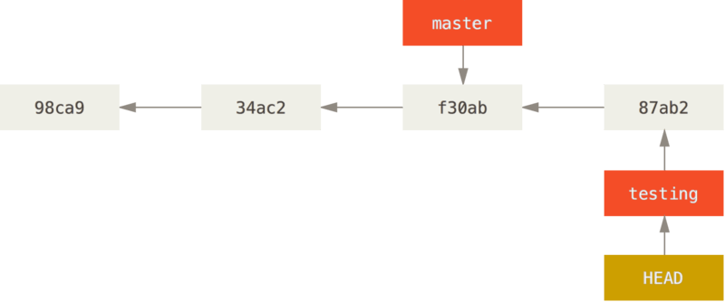

# learning-git
git勉強用のリポジトリ

## [公式Book](https://git-scm.com/book/en/v2)
***
### 1章
SVNなどのVCS(Version Control System)はファイル毎に変更履歴を保持している。

Gitはすべてのファイルの状態のスナップショットを撮り、そのスナップショットへの参照を格納している。

Gitはコミットデータを削除しない

#### セットアップ
下の設定が優先的に設定されていく
- [path]/etc/gitconfig
  システム上のすべてのユーザーとそのすべてのリポジトリに適用される  
  `git config --system`
- ~/.gitconfig or ~/.config/git/config
  ユーザー固有の設定  
  `git config --global`
- [対象ディレクトリ]/.git/config
  ディレクトリ固有の設定  
  `git config --local`

※全ての設定を確認したいときは以下のコマンドを使う  
`git config --list --show-origin`
***
### 3章
#### コミットとは何か？
コミットオブジェクト
- ステージしたコンテンツのスナップショット(treeオブジェクト)へのポインター
- 作成者
- メールアドレス
- コミットメッセージ
- 直前のコミットへのポインター

状態
- Modifired:ファイルは更新されているがコミットされていない状態
- Staged:
  次のコミットのスナップショットに入る更新されたファイルをマークしている状態
  各ファイルのチェックサム(ハッシュ値)が計算され、blobという単位でGit repositoryに保存する
- Committed:
  データがローカルデータベースに保存された状態
  各サブディレクトリ毎にチェックサムを計算し、treeオブジェクトとしてGit repositoryに保存する
  メタデータとルートプロジェクトのtreeオブジェクトへのポインターを持つCommitオブジェクトを作成する

#### 新しいブランチを作成する
`git branch hoge`  
現在実行しているのと同じコミットへの新しいポインターが作成される

#### 現在のブランチの切り替え
HEADが指すブランチへのポインターが切り替わる
`git branch hoge`コマンドでブランチを作成した直後は以下のようにHEADが指し示すブランチへのポインターは切り替わらない

ブランチを切り替えたい場合はcheckoutコマンドを実行する  
`git checkout hoge`  
するとHEADが切り替え先のブランチのポインターを持つようになる

ここで新しいコミットを実行すると次のようなイメージとなる

