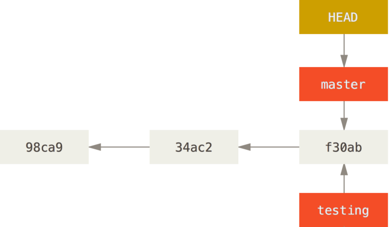
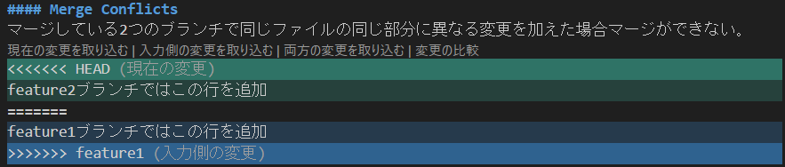
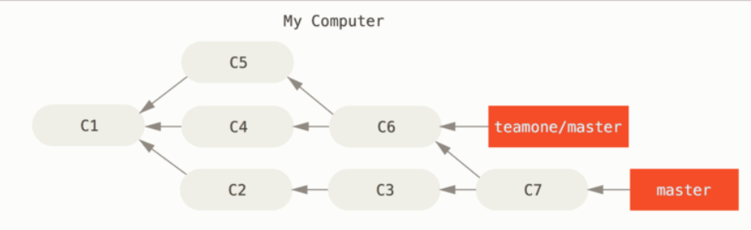

# learning-git
git勉強用のリポジトリ  
**[公式Book](https://git-scm.com/book/en/v2)**

## 目次
- [learning-git](#learning-git)
  - [目次](#目次)
  - [1章](#1章)
    - [セットアップ](#セットアップ)
  - [3章](#3章)
    - [ブランチの概要](#ブランチの概要)
        - [コミットとは何か？](#コミットとは何か)
      - [新しいブランチを作成する](#新しいブランチを作成する)
      - [現在のブランチの切り替え](#現在のブランチの切り替え)
    - [基本的なBranchとMerge](#基本的なbranchとmerge)
      - [Merge Conflicts](#merge-conflicts)
    - [ブランチ管理](#ブランチ管理)
    - [Rebase](#rebase)
  - [7章](#7章)
    - [Stashing](#stashing)
    - [Cleaning](#cleaning)


***
## 1章
SVNなどのVCS(Version Control System)はファイル毎に変更履歴を保持している。


Gitはすべてのファイルの状態のスナップショットを撮り、そのスナップショットへの参照を格納している。


Gitはコミットデータを削除しない

### セットアップ
下の設定が優先的に設定されていく
- [path]/etc/gitconfig
  システム上のすべてのユーザーとそのすべてのリポジトリに適用される  
  `git config --system`
- ~/.gitconfig or ~/.config/git/config
  ユーザー固有の設定  
  `git config --global`
- [対象ディレクトリ]/.git/config
  ディレクトリ固有の設定  
  `git config --local`

※全ての設定を確認したいときは以下のコマンドを使う  
`git config --list --show-origin`
***
## 3章
### ブランチの概要
##### コミットとは何か？
コミットオブジェクト
- ステージしたコンテンツのスナップショット(treeオブジェクト)へのポインター
- 作成者
- メールアドレス
- コミットメッセージ
- 直前のコミットへのポインター

状態
- Modifired:ファイルは更新されているがコミットされていない状態
- Staged:
  次のコミットのスナップショットに入る更新されたファイルをマークしている状態
  各ファイルのチェックサム(ハッシュ値)が計算され、blobという単位でGit repositoryに保存する
- Committed:
  データがローカルデータベースに保存された状態
  各サブディレクトリ毎にチェックサムを計算し、treeオブジェクトとしてGit repositoryに保存する
  メタデータとルートプロジェクトのtreeオブジェクトへのポインターを持つCommitオブジェクトを作成する


#### 新しいブランチを作成する
`git branch hoge`  
現在実行しているのと同じコミットへの新しいポインターが作成される  


#### 現在のブランチの切り替え
HEADが指すブランチへのポインターが切り替わる
`git branch hoge`コマンドでブランチを作成した直後は以下のようにHEADが指し示すブランチへのポインターは切り替わらない  


ブランチを切り替えたい場合はcheckoutコマンドを実行する  
`git checkout hoge`  
するとHEADが切り替え先のブランチのポインターを持つようになる  


ここで新しいコミットを実行すると次のようなイメージとなる  


ブランチが分岐する場合は次のようなイメージ    


### 基本的なBranchとMerge
**ストーリー**  
新しい機能を開発中、別の重要な問題が発生。hotfixが必要。次の流れで開発を行っていく。
1. 本番ブランチに切り替える  
   切り替えようとしているブランチと競合するコミットされていない変更がある場合、ブランチ切り替えはできない。  
   例：本番ブランチにREADME.mdがあり、featureブランチでREADME.mdを変更しているとき
   ```
    $ git status
    ブランチ feature
    Your branch is up to date with 'origin/feature'.

    Changes not staged for commit:
      (use "git add <file>..." to update what will be committed)
      (use "git restore <file>..." to discard changes in working directory)
            modified:   README.md

    no changes added to commit (use "git add" and/or "git commit -a")

    $ git checkout main 
    error: Your local changes to the following files would be overwritten by checkout:
            README.md
    Please commit your changes or stash them before you switch branches.
    Aborting
   ```

2. hotfixブランチを作成する
3. hotfixブランチをマージする  
   マージ後はhotfixブランチを削除する  
   `git branch -d hotfix`
4. 元の機能開発に戻る  
hotfixブランチをmsterブランチにマージした直後は以下のイメージ  
  
元の機能開発が終了しmasterブランチへマージすると以下のイメージ


#### Merge Conflicts
マージしている2つのブランチで同じファイルの同じ部分に異なる変更を加えた場合マージができない  
feature2ブランチではこの行を追加  
feature1ブランチではこの行を追加  
```
$ git merge feature1
Auto-merging README.md
CONFLICT (content): Merge conflict in README.md
Automatic merge failed; fix conflicts and then commit the result.
```


### ブランチ管理
ローカル、リモートのブランチ名を変更したい場合  
`git branch --move old-branch-name new-branch-name`  
`git push origin new-branch-name`  
`git push origin --delete old-branch-name`  
リモートのブランチ名を取得したい場合  
`git ls-remote`  
`git branch -r`  
※リモートのブランチがローカルに反映されない場合は以下のコマンドを実行する  
`git remote prune origin`  
`git pull --prune`

### Rebase
C4で適用された修正をC3に再適用することができる。  
  
Gitの履歴をより単純にすることができる。最終的な成果物はマージの場合と変わらない。  

**別の人が作業を行っている可能性があるコミットをリベースしてはいけない**  
以下の状況を過程する  
   
そこでチームのメンバーがC6のコミットをC5のコミットにrebaseすると、自身のローカルリポジトリにはrebase後の履歴とrebase前の履歴の両方が存在することになってしまう    
  
ちなみに、このような状況に陥ってしまった場合は、`git rebase teamone/master`を実行することで以下のような履歴にすることができる。ただし、C4とC4'はほぼ同じでないと適用できない。
  

## 7章
### Stashing
ブランチを切り替える際に、今のブランチで行っている作業をコミットしたくない場合に`git stash`コマンドが使える。
### Cleaning